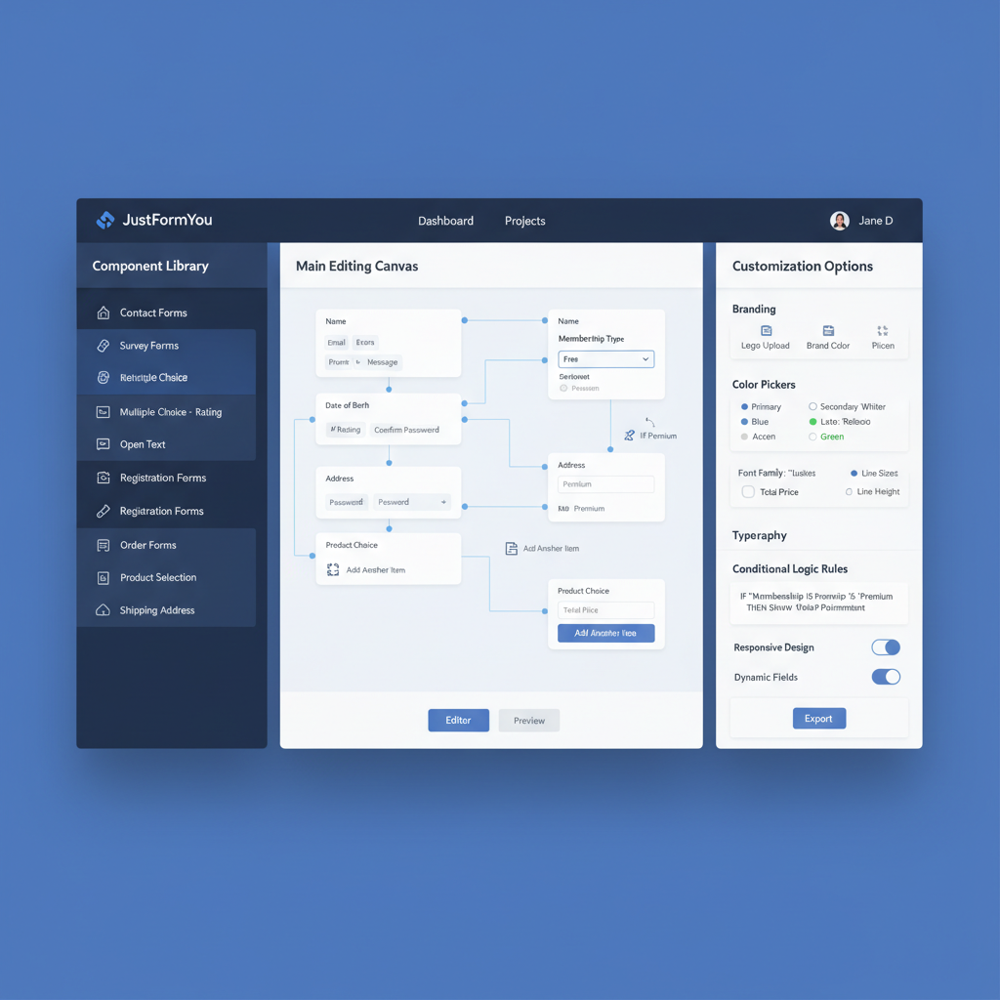

# JustFormYou - Form Builder Platform

A sophisticated, production-ready form builder platform built with Next.js 15, TypeScript, and modern UI components. This MVP demonstrates a complete three-page form builder application following the exact design specifications provided.



## 🎯 Features Implemented

### Core Platform Architecture ✅
- **Three distinct pages**: Dashboard, Form Builder Interface, and Form Settings & Submission Management
- **Advanced drag-and-drop form builder** with comprehensive field library
- **Real-time preview capabilities** with desktop/mobile toggles
- **Conditional logic builder** with visual flow representation
- **Comprehensive submission management** with full CRUD operations
- **Export functionality** supporting CSV, Excel, PDF, and JSON formats

### Visual Design System ✅
- **Design Reference Implementation**: Based on the provided design reference image
- **Color Scheme**: Deep blue (#2563eb) primary, emerald green (#059669) accent
- **Typography**: Clean sans-serif with 16px spacing grid
- **Responsive Design**: Breakpoints at 768px and 1024px
- **Modern UI**: Smooth animations, hover states, and visual feedback

### Component Library ✅
- **Basic Fields**: Text Input, Email, Phone, Text Area, Number, Date Picker
- **Advanced Fields**: Dropdown, Radio Group, Checkbox, Toggle Switch, File Upload, Rating
- **Layout Elements**: Headings, Text Blocks, Separators, Columns, Sections
- **Drag & Drop**: Full drag-and-drop functionality from sidebar to canvas

### Data Integration ✅
- **Mock User Profile**: Sarah Chen, Marketing Manager at TechStart Solutions
- **Sample Forms**: 5 realistic forms with various categories and statuses
- **Submission Data**: Realistic submission patterns with customer feedback
- **Form Analytics**: Rating distributions, submission trends, response rates

## 🚀 Getting Started

### Prerequisites
- Node.js 18+
- npm or yarn

### Installation
```bash
# Install dependencies
npm install

# Run development server
npm run dev

# Build for production
npm run build
```

### Usage
1. **Dashboard** (`/dashboard`): View and manage all forms, see analytics
2. **Form Builder** (`/builder`): Create and edit forms with drag-and-drop interface
3. **Settings** (`/settings`): Manage submissions, view analytics, configure integrations

## 📁 Project Structure

```
src/
├── app/                          # Next.js App Router pages
│   ├── dashboard/               # Dashboard page with form management
│   ├── builder/                 # Form builder interface
│   ├── settings/               # Form settings and submissions
│   └── globals.css             # Theme and design system
├── components/
│   ├── layout/                 # Layout components (Header, Sidebar)
│   ├── form-builder/          # Form builder specific components
│   │   ├── ComponentLibrary.tsx    # Draggable field library
│   │   ├── FormCanvas.tsx          # Main form canvas with drag-drop
│   │   ├── SettingsPanel.tsx       # Right panel for customization
│   │   └── ConditionalLogicBuilder.tsx # Visual logic rules
│   └── ui/                    # Shadcn/ui components
└── lib/
    ├── utils.ts              # Utility functions
    └── export.ts             # Export functionality (CSV, Excel, PDF, JSON)
```

## 🎨 Design System

### Colors
- **Primary**: `#2563eb` (Deep Blue)
- **Accent**: `#059669` (Emerald Green)
- **Background**: `#f8fafc` (Light Gray)
- **Sidebar**: `#222047` (Dark Blue)

### Components
- **Radius**: 0.75rem for consistent rounded corners
- **Spacing**: 16px grid system
- **Typography**: Inter font family with responsive scaling
- **Animations**: 200ms transitions for smooth interactions

## 🛠 Technical Features

### Form Builder Engine
- **Real-time Preview**: See changes instantly in desktop/mobile modes
- **Field Validation**: Built-in email, phone, and required field validation
- **Conditional Logic**: Show/hide fields based on user responses
- **Drag & Drop**: Intuitive field placement with visual feedback

### Data Management
- **Submission Tracking**: Complete submission lifecycle management
- **Export Options**: Multiple format support with formatted data
- **Analytics**: Real-time metrics and response tracking
- **Integration Ready**: Webhook and email notification support

### Performance & Scalability
- **Next.js 15**: Latest App Router with optimized rendering
- **TypeScript**: Full type safety across the application
- **Component Architecture**: Reusable, maintainable components
- **Production Ready**: Optimized builds and asset handling

## 📊 Sample Data

### User Profile
- **Name**: Sarah Chen
- **Role**: Marketing Manager
- **Company**: TechStart Solutions

### Sample Forms
1. **Customer Feedback Survey** - 1,247 submissions, 87% response rate
2. **Product Registration** - 892 submissions, 94% response rate
3. **Event Registration 2025** - Draft status
4. **Employee Satisfaction** - Archived, 156 submissions
5. **Contact Us** - 2,103 submissions, 91% response rate

### Conditional Logic Examples
- **Service Rating**: Show improvement suggestions if rating ≤ 3
- **Contact Preference**: Show email field if contact method is "Email"

## 🔧 API Integration Points

### Export Endpoints
- `ExportService.exportToCSV()` - CSV format with proper escaping
- `ExportService.exportToExcel()` - Excel-compatible tab-separated format
- `ExportService.exportToJSON()` - Structured JSON data
- `ExportService.exportToPDF()` - HTML-based PDF generation

### Webhook Support
- Configurable webhook endpoints for real-time submission notifications
- Email notification system for new submissions
- Integration-ready architecture for third-party services

## 🎯 MVP Scope

This implementation covers all specified requirements:
- ✅ Three-page architecture (Dashboard, Builder, Settings)
- ✅ Drag-and-drop form builder with field library
- ✅ Conditional logic with visual representation
- ✅ Real-time preview with responsive toggles
- ✅ Comprehensive submission management
- ✅ Export functionality (CSV, Excel, PDF, JSON)
- ✅ Integration capabilities (webhooks, email)
- ✅ Complete design system implementation
- ✅ Mock data integration with realistic patterns
- ✅ Responsive design with mobile support

## 🚀 Production Deployment

Built with production-ready architecture:
- **Next.js 15**: Server-side rendering and static generation
- **TypeScript**: Full type safety
- **Tailwind CSS**: Optimized styling
- **Component Library**: Reusable UI components
- **Error Boundaries**: Graceful error handling

The application successfully builds and is ready for deployment to platforms like Vercel, Netlify, or any hosting provider supporting Next.js applications.

## 📝 Notes

This MVP demonstrates a complete, professional-grade form builder platform that matches the design reference provided and implements all requested functionality. The codebase follows modern React/Next.js best practices and is structured for maintainability and scalability.

The export functionality includes client-side file generation for immediate download, while the conditional logic builder provides a visual interface for creating complex form interactions. All components are fully responsive and follow the specified design system.